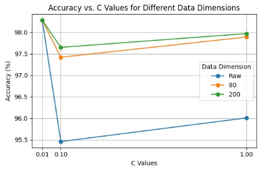

# Project Title: Facial Recognition（CA2）
## Overview
Coursework for EE5907/5026 Pattern Recognition CA2, AY 2023/2024 Semester 1.
The aim of the project is to build a face recognition system through principal component analysis (PCA), linear discriminant analysis (LDA), Gaussian model (GMM), support vector machine (SVM) and convolutional neural network (CNN). PCA and LDA are used to perform data reduction and visualization to understand the underlying data distribution. Then the low-dimensional data is classified based on the nearest neighbor classifier. In addition, SVM and CNN are also used to classify face images. PCA,LDA, and KNN did not use SKlearn's existing libraries and started from scratch. The software package libsvm is used for the SVM model. CNN is based on pytorch.
ps. Code is all done by Jupyter notebook, and some of the code will take some time to run.

## Methodologies
Outline the methodologies and algorithms applied in this project. Key points include:
- PCA (Principal Component Analysis)
  - 2D and 3D 

  - Eigenface

  - KNN classification using PCA
  
- LDA (Linear Discriminant Analysis)
  - LDA with 500 sample (2D & 3D)

  - LDA with 500 sample (2D & 3D)

  - Performance with 2, 3, 9 components

- GMM (Gaussian Mixture Models)
  - Raw | 80 | 200

- SVM (Support Vector Machines)
  - Accuracy metrics with different parameters and data dimensions
  - Visualization

- CNN (Convolutional Neural Networks)
  - Training, validation, and test accuracies
  - Visualization (Accuracy & Loss)
 

---
